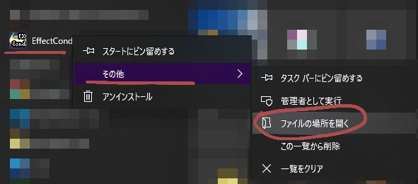
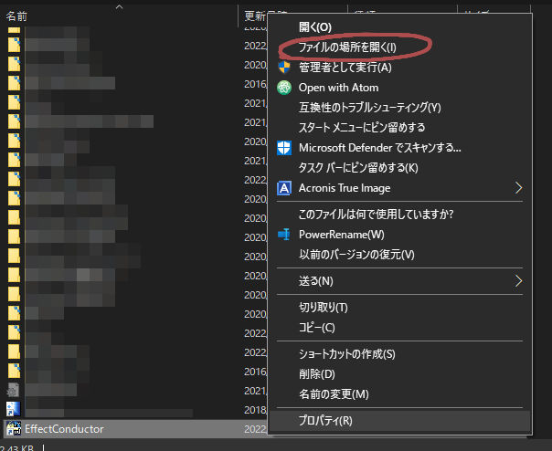
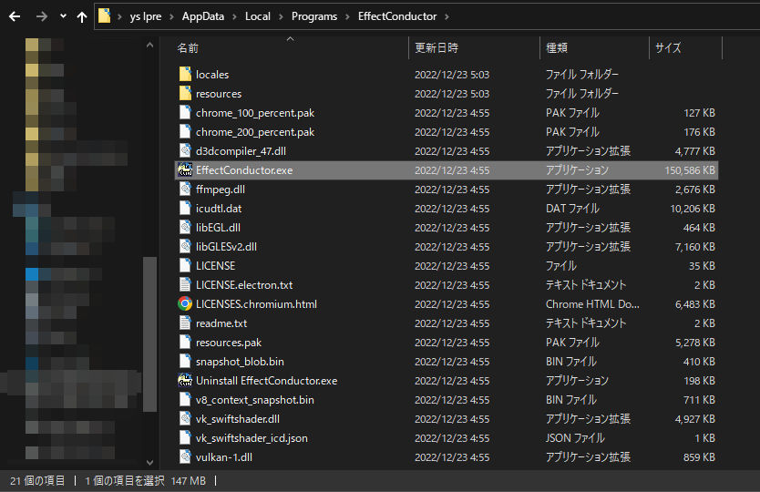
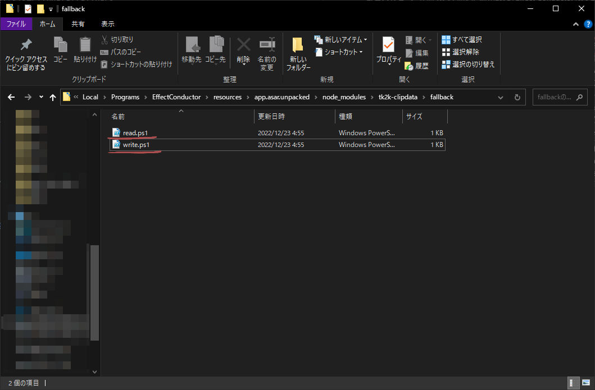
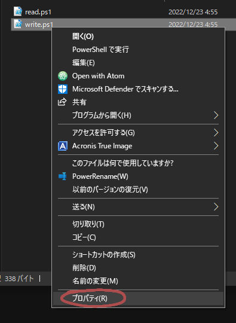
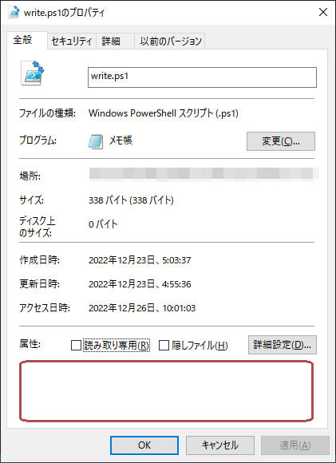

COPY!!ボタンでエラーが出た場合
===================================

クリップボード操作に使うスクリプトが、セキュリティ設定で実行できない場合に、"COPY!!"ボタンが動作しないようです。  
下記にて、実行許可を与えてみてください。

インストール先を開く
----------------------

### zip解凍の場合

解凍先フォルダを開いてください。

### exeにてインストールした場合

下記手順にて、インストール先フォルダを開いてください。

1. スタートメニュー等のショートカットを右クリックし、「その他」-> 「ファイルの場所を開く」を選択  

2. エクスプローラーが開くので、開いた場所にある「Effect Conductor」のショートカットファイルを右クリック  
「ファイルの場所を開く」を選択  

3. エクスプローラー内の開いているフォルダが移動し、「Effect Conductor.exe」が表示されている事を確認する


スクリプトのフォルダを開く
---------------------

インストール先フォルダ内、下記フォルダを辿る

resources/app.asar.unpacked/node_modules/tk2k-clipdata/fallback

開いた先に、下記2つのファイルがある事を確認する

* write.ps1
* read.ps1



スクリプトのセキュリティ設定を変更する
---------------------------------

```write.ps1```, ```read.ps1```の2つのファイルに対して、下記手順でセキュリティ設定を変更してください

※```write.ps1```は"COPY!!"ボタンで、```read.ps1```は"クリップボードから読み込み"ボタンで使用しています

1. スクリプトを右クリックし、「プロパティ」を選択  

2. 「全般」タブ下部、「セキュリティ: このファイルは他のコンピュータから取得したものです。このコンピュータを保護するため、このファイルへのアクセスはブロックされる可能性があります。」という項目があるので、その右、「許可する」チェックボックスをONにする。  
  
※手元で再現しなかったため、スクリーンショット上に項目がありません。赤枠のあたりに表示されるはずです。

設定完了
-----------

以上で、セキュリティ設定は完了です。再度、"COPY!!"ボタンをお試しください。
